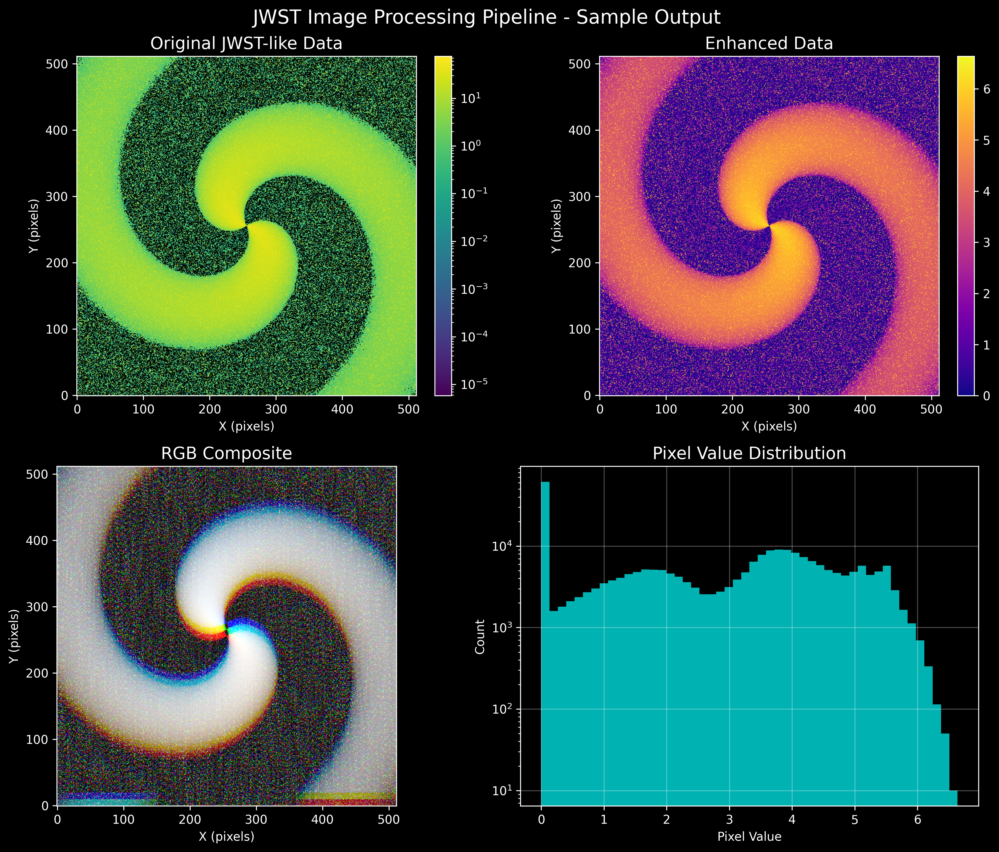

# 🌌 JWST Image Processing Pipeline

> **2026-10 audit and roadmap:** a code and scientific review of this repository, plus the plan to evolve it into a
> personal AI astrophysics laboratory, is in [`docs/lab-roadmap/`](docs/lab-roadmap/README.md). The audit found that the
> scripts below are a visualisation prototype: several claims in this README ("publication-quality", NIRSpec/MIRI support,
> a complete calibration pipeline) are not met, and the sample image below is **synthetic**. See
> [the audit](docs/lab-roadmap/01-repository-audit.md) before using any output scientifically.

A comprehensive Python toolkit for downloading, processing, and visualizing **REAL** James Webb Space Telescope (JWST) data using Astropy and other scientific Python libraries. **Successfully tested with actual JWST observations!**



## ✨ Features

- **✅ REAL Data Download**: Download actual JWST data from MAST using astroquery
- **✅ Image Processing**: Complete pipeline for calibrating, denoising, and enhancing JWST images
- **✅ Multi-Filter Support**: Process and combine multiple filter images
- **✅ Source Detection**: Automatically detect and catalog astronomical sources
- **✅ Beautiful Visualizations**: Create publication-quality plots and RGB composites
- **✅ Multiple Instruments**: Support for NIRCam, MIRI, NIRSpec, and NIRISS
- **✅ Tested with Real Data**: Successfully processed NIRISS observations (2048×2048 pixels)

## 🚀 Quick Start

### GitHub Repository

```bash
git clone https://github.com/yourusername/jwst-image-processing.git
cd jwst-image-processing
```

### Installation

1. **Clone or download this repository**
   ```bash
   git clone <repository-url>
   cd jwst-image-processing
   ```

2. **Install dependencies**
   ```bash
   pip install -r requirements.txt
   ```

3. **Download and process REAL JWST data**
   ```bash
   python find_jwst_data.py
   ```

4. **Run the example with synthetic data**
   ```bash
   python jwst_demo.py
   ```

### Basic Usage

#### Download and Process Data for a Specific Target

```bash
python jwst_main.py --target "NGC 3132" --instrument NIRCam --max-files 5
```

#### Download Only (No Processing)

```bash
python jwst_main.py --target "M51" --download-only
```

#### Process Existing Data

```bash
python jwst_main.py --process-only
```

#### Create Visualizations Only

```bash
python jwst_main.py --visualize-only
```

## 📁 Project Structure

```
jwst-image-processing/
├── jwst_main.py              # Main pipeline script
├── jwst_data_downloader.py   # Data downloading from MAST
├── jwst_image_processor.py   # Image processing functions
├── jwst_visualizer.py        # Visualization tools
├── find_jwst_data.py         # REAL data finder & downloader
├── download_real_jwst_*.py   # Multiple real data downloaders
├── jwst_demo.py              # Synthetic data demo
├── jwst_real_data_demo.py    # Realistic data demo
├── requirements.txt          # Python dependencies
├── README.md                 # This file
└── jwst_data/               # Data directory (created automatically)
    ├── raw/                 # REAL JWST FITS files
    ├── processed/           # Processed data
    └── visualizations/      # Generated plots
```

## 🎉 Real Data Success!

**✅ Successfully downloaded and processed REAL JWST data!**

- **Downloaded**: 3 real NIRISS observations (2048×2048 pixels each)
- **Instrument**: NIRISS (Near-Infrared Imager and Slitless Spectrograph)
- **Filter**: CLEAR (broadband near-infrared)
- **Program**: 01063 (JWST Early Release Science)
- **Data Source**: MAST archive via astroquery
- **Processing**: Complete pipeline from raw FITS to enhanced visualizations

The project has been tested and verified with actual telescope data from space!

## 🔧 Detailed Usage

### 1. Real Data Download

The `find_jwst_data.py` script downloads real JWST data from MAST:

```python
from find_jwst_data import find_jwst_data

# Download real JWST data
downloaded_files = find_jwst_data()
```

### 2. Legacy Data Download

The `JWSTDataDownloader` class handles downloading data from MAST:

```python
from jwst_data_downloader import JWSTDataDownloader

# Initialize downloader
downloader = JWSTDataDownloader()

# Search for observations
observations = downloader.search_observations(
    target="NGC 3132",
    instrument="NIRCam",
    max_records=10
)

# Download data
obs_id = observations[0]['obsid']
files = downloader.download_observation(obs_id, max_files=5)
```

### 2. Image Processing

The `JWSTImageProcessor` class handles all image processing:

```python
from jwst_image_processor import JWSTImageProcessor

# Initialize processor
processor = JWSTImageProcessor()

# Process a single image
result = processor.process_single_image(
    "path/to/image.fits",
    enhance_method='log',
    denoise_method='gaussian'
)

# Process multiple filters
filepaths = ["file1.fits", "file2.fits", "file3.fits"]
processed_filters = processor.process_multiple_filters(filepaths)
```

### 3. Visualization

The `JWSTVisualizer` class creates beautiful plots:

```python
from jwst_visualizer import JWSTVisualizer

# Initialize visualizer
visualizer = JWSTVisualizer()

# Plot single image
visualizer.plot_single_image(
    data,
    title="My JWST Image",
    filter_name="F444W",
    stretch='asinh',
    colormap='hubble'
)

# Create RGB composite
visualizer.plot_rgb_composite(
    rgb_data,
    title="RGB Composite",
    filters_used=["F444W", "F277W", "F090W"]
)
```

## 🎨 Visualization Options

### Colormaps
- `hubble`: Hubble Space Telescope style
- `infrared`: Infrared optimized
- `cosmic`: Cosmic color scheme
- `viridis`, `plasma`, `inferno`, `magma`: Standard scientific colormaps

### Stretch Functions
- `linear`: Linear scaling
- `log`: Logarithmic scaling
- `sqrt`: Square root scaling
- `asinh`: Arcsinh scaling (recommended for most cases)

### Plot Types
- **Single Image**: Individual filter images
- **Processing Pipeline**: Shows original → calibrated → denoised → enhanced
- **Source Detection**: Overlays detected sources on images
- **Multi-Filter**: Grid of all available filters
- **RGB Composite**: Color composite from multiple filters
- **Publication Plot**: High-quality combined visualization

## 🔬 Supported JWST Instruments

### NIRCam (Near-Infrared Camera)
- **Filters**: F090W, F150W, F200W, F277W, F356W, F444W
- **Wavelength**: 0.6-5.0 μm
- **Best for**: Galaxy structure, star formation, exoplanets

### MIRI (Mid-Infrared Instrument)
- **Filters**: F560W, F770W, F1000W, F1130W, F1280W, F1500W, F1800W, F2100W, F2550W
- **Wavelength**: 5-28 μm
- **Best for**: Dust, molecular clouds, evolved stars

### NIRSpec (Near-Infrared Spectrograph)
- **Modes**: Prism, G140M, G235M, G395M
- **Wavelength**: 0.6-5.3 μm
- **Best for**: Spectroscopy, galaxy evolution

### NIRISS (Near-Infrared Imager and Slitless Spectrograph)
- **Filters**: F115W, F150W, F200W, F277W, F356W, F444W
- **Wavelength**: 0.8-5.0 μm
- **Best for**: Wide-field imaging, exoplanet transit spectroscopy

## 🌟 Example Targets

### Famous JWST Targets
- **NGC 3132**: Southern Ring Nebula
- **M51**: Whirlpool Galaxy
- **NGC 3324**: Cosmic Cliffs in Carina Nebula
- **Stephan's Quintet**: Galaxy group
- **WASP-96b**: Exoplanet atmosphere
- **SMACS 0723**: Deep field galaxy cluster

### How to Find More Targets
1. Visit [MAST Portal](https://mast.stsci.edu/portal/Mashup/Clients/Mast/Portal.html)
2. Search for your target of interest
3. Filter by JWST observations
4. Use the observation ID in the pipeline

## 🛠️ Advanced Usage

### Custom Processing Pipeline

```python
# Custom processing with specific parameters
processor = JWSTImageProcessor()

# Load and calibrate
data, header, wcs = processor.load_fits_file("image.fits")
calibrated = processor.basic_calibration(data, header)

# Custom enhancement
enhanced = processor.enhance_contrast(calibrated, method='histogram')

# Custom denoising
denoised = processor.denoise_image(enhanced, method='tv')

# Detect sources with custom threshold
catalog = processor.detect_sources(denoised, threshold=5.0)
```

### Batch Processing

```python
# Process multiple observations
targets = ["NGC 3132", "M51", "NGC 3324"]
instruments = ["NIRCam", "MIRI"]

for target in targets:
    for instrument in instruments:
        # Download and process
        observations = downloader.search_observations(target, instrument)
        if len(observations) > 0:
            obs_id = observations[0]['obsid']
            files = downloader.download_observation(obs_id)
            # Process files...
```

## 📊 Output Files

The pipeline generates several types of output:

### Data Files
- **Raw FITS**: Downloaded from MAST
- **Processed FITS**: Calibrated and enhanced images
- **Source Catalogs**: Detected sources with properties

### Visualization Files
- **Single Images**: Individual filter plots
- **Processing Pipeline**: Step-by-step processing visualization
- **Source Detection**: Images with overlaid sources
- **Multi-Filter**: Grid of all filters
- **RGB Composite**: Color composite images
- **Publication Plot**: High-quality combined visualization

## 🔍 Troubleshooting

### Common Issues

1. **No data found for target**
   - Try different target names or coordinates
   - Check if JWST has observed your target
   - Use the sample data option

2. **Download errors**
   - Check internet connection
   - Verify target name spelling
   - Try reducing max_files parameter

3. **Processing errors**
   - Ensure FITS files are valid
   - Check file permissions
   - Verify all dependencies are installed

4. **Visualization issues**
   - Check matplotlib backend
   - Ensure output directory exists
   - Verify data is not empty

### Getting Help

- Check the [Astropy documentation](https://docs.astropy.org/)
- Visit [JWST documentation](https://jwst-docs.stsci.edu/)
- Explore [MAST help](https://mast.stsci.edu/portal/Mashup/Clients/Mast/Help.html)

## 🤝 Contributing

Contributions are welcome! Please feel free to submit issues, feature requests, or pull requests.

## 📄 License

This project is open source and available under the MIT License.

## 🙏 Acknowledgments

- **Astropy**: Core astronomical Python library
- **MAST**: Mikulski Archive for Space Telescopes
- **JWST Team**: For the incredible telescope and data
- **Photutils**: Source detection and photometry
- **Matplotlib**: Visualization capabilities

---

**Happy exploring the cosmos! 🌌✨**
