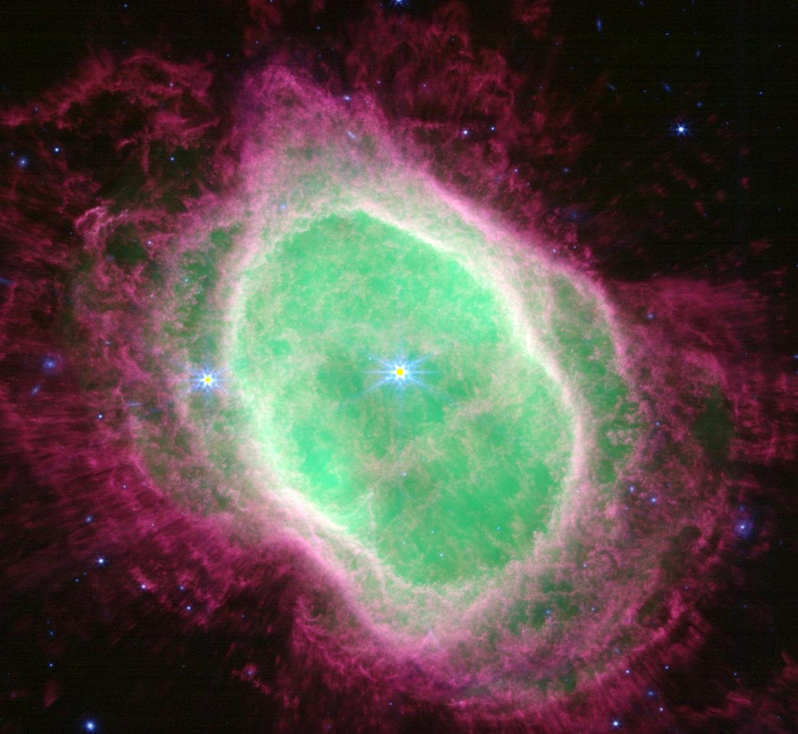
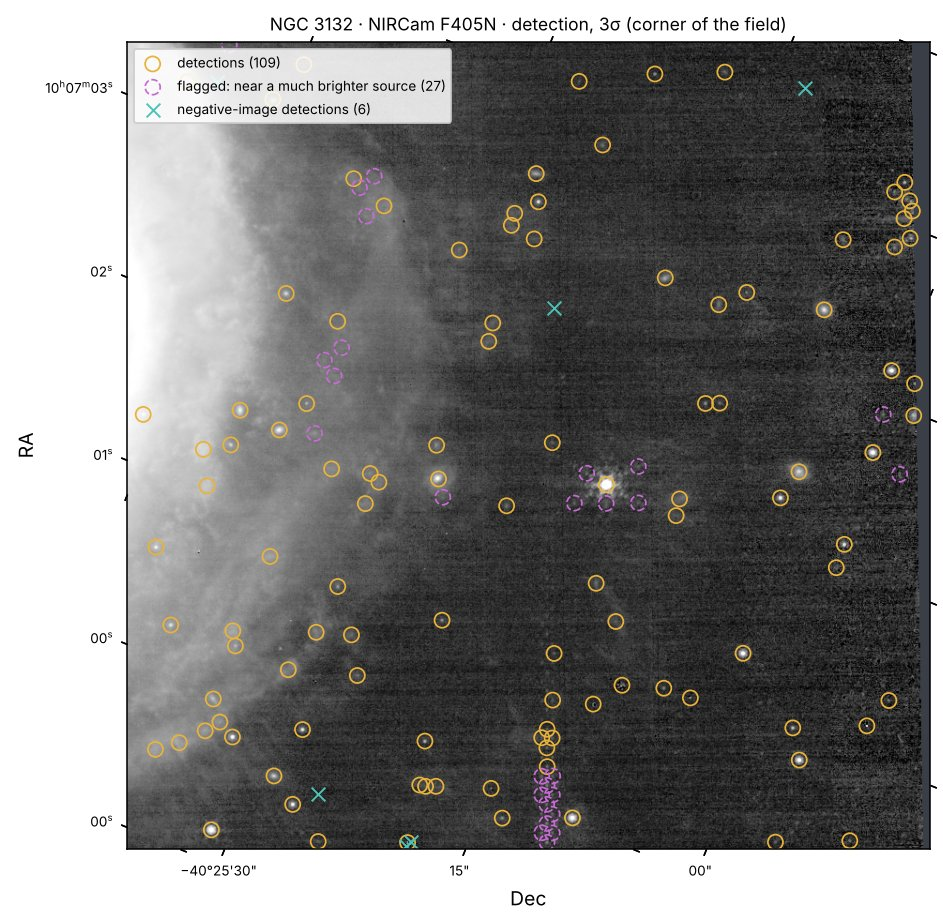

# Update report: 6 October 2026

**Scope:** roadmap §27 tasks 1–12 (Phase 0 and the first Phase 1–2 capabilities), tested on
authentic JWST data. Every result below can be reproduced with
[`examples/ngc3132_example.py`](../../examples/ngc3132_example.py).

*NGC 3132 (the Southern Ring planetary nebula), built by astroledger from public JWST Stage-3
mosaics of program 2733, in representative colour:*

| Channel | Filter | Traces |
|---|---|---|
| Red | F470N | H₂, the molecular hydrogen in the outer filaments |
| Green | F405N | Brackett-α, the ionised gas in the inner bubble |
| Blue | F356W | stars and background galaxies |

*How it was made:*
- the three mosaics were reprojected onto one grid and each channel scaled with a display-only asinh stretch;
- the yellow dots at the star centres are saturated cores masked in F356W;
- data source: MAST public AWS copy, row band 480–1880 of each mosaic, fetched with byte-range requests.

## What was done

| Task | Delivered |
|---|---|
| 1–2 | Fabricated filenames removed; README corrected; original scripts frozen in `legacy/` (checksum-enforced) |
| 3–4 | `astroledger` package, `uv.lock`, ruff, pytest, CI on Python 3.11/3.13; legacy defects as strict expected-failure tests |
| 5 | `open_image`: JWST/HST/plain FITS with unit, ERR, NaN+DQ mask, WCS, headers, checksum, reader notes |
| 6 | `Bandpass`: true filter from FILTER/PUPIL (NIRCam pupil wheel, NIRISS), HST ACS wheels |
| 7 | `viz`: sky-axis display, chromatic colour composites on a common grid; data provably unchanged |
| 8 | `provenance`: every step records inputs' checksums, parameters, versions, git commit (SQLite + JSON) |
| 9 | `archives`: MAST search (astroquery); MAST's AWS copy with ETag-verified downloads and range-request cutouts under a byte budget |
| 10 | `astroledger inspect FILE`: fact sheet of metadata and pixel measurements |
| 11 | `photometry`: aperture fluxes in Jy and AB with uncertainties and background-stability flag |
| 12 | `imaging.detect`: matched-filter detection with a located false-positive estimate and bright-neighbour flag |

**Tests:** 122 pass. 7 strict expected failures document defects of the legacy code. CI is green.

## Validation on authentic data

| Check | Result |
|---|---|
| Complete MIRI F770W `cal` exposure (29.7 MB) | Checksum matches the archive ETag. Units MJy/sr, 32% masked (the coronagraph/LRS field, flagged DO_NOT_USE). WCS centre within the field of NGC 3132. |
| Range-request cutout | An independently fetched row is byte-identical to the cutout. WCS agrees with the original to 0 mas. |
| Bandpass on real headers | `FILTER=F444W` + `PUPIL=F405N` gives F405N; `F444W` + `F470N` gives F470N. The legacy code merged both as "F444W". |
| Photometry vs JWST pipeline catalogue (jwst 2.0.1), 268 measurements at the pipeline's radii | Fluxes agree to < 1×10⁻⁶. ERR-only errors identical. Aperture-corrected totals agree to 2.5×10⁻⁷. AB magnitudes agree to 7×10⁻⁵ mag. |
| Detection vs pipeline catalogue | Clean sky (> 65″ from the nebula): 34/34 pipeline sources recovered, median centroid offset 3.6 mas, 4 negative-image detections. Inside the nebula, detections are mostly knots of emission (see below). |

*Detections (gold), heuristic flags near much brighter sources (magenta), and negative-image
detections (cyan) in a corner of the F405N mosaic. The chain at bottom centre is a
diffraction spike from a bright star outside the cutout, which the flag cannot see.*

## What the testing found and changed

- **Photometry background.** One star differed from the pipeline by 1.7σ. Its background annulus
  lies on the nebula, where the sigma-clipped median never converges. The fix: the pipeline's
  convention (5 iterations), plus a new `bkg_unstable` flag that marks such stars. The pipeline
  catalogue gives no such warning.
- **Deblending.** Overlaying detections on the real image showed deblending splitting a bright
  star into about 8 "sources", and diffraction spikes breaking into chains. Deblending is now
  opt-in (the JWST pipeline's default), and `near_bright_source` flags likely PSF fragments.
- **Structured emission.** In the nebula, the negative-image test finds 46 false detections
  where the background mesh cannot follow the clumpy emission. Detections there are significant
  positive features, not necessarily stars. The detector says so in its notes.
- **Code bugs fixed:**
  - Quantity truthiness in `Bandpass.__str__`;
  - an over-long FITS keyword comment;
  - unclosed SQLite connections;
  - the reader recording unrelated `ResourceWarning`s.

## Data used (download budget: 100 MB)

84.6 MB in 32 transfers, all from `s3://stpubdata/jwst/public/jw02733/` and logged in a ledger:

| Data | Size |
|---|---|
| One complete MIRI `cal` file | 29.7 MB |
| NIRCam F405N rows 480–1880 (SCI + ERR) | 26.4 MB |
| NIRCam F470N and F356W rows 480–1880 (SCI) | 13.3 MB each |
| Pipeline catalogue | 0.36 MB |
| Headers and one preview JPEG | 0.9 MB |

## Known limits

- **MAST API is blocked in this cloud environment** (`mast.stsci.edu`). `archives.mast.search` is
  unit-tested with a mocked astroquery but not run live here. The AWS copy (`stpubdata`) works.
- **JWST pivot wavelengths** are not bundled; official throughput tables were unreachable.
  Bandpasses carry the *nominal* wavelength from the filter name, and the pivot only when a
  header provides it (HST).
- **Resampled (`i2d`/`drz`) noise is correlated.** ERR-based photometric errors are lower limits
  (stated in the output). An empirical correction is a later task.
- **The JWST Stage-2 WCS** is read from the FITS SIP approximation. The GWCS in the ASDF
  extension is not used yet.

## Next

- Task 13: injection–recovery completeness.
- Task 14: Gaia cross-match and astrometric QA.
- Task 15: explicit mode router.

The pull request
[Sarvesh2304/JWST_image_processing#1](https://github.com/Sarvesh2304/JWST_image_processing/pull/1)
holds all of this work for merging into `main`.
