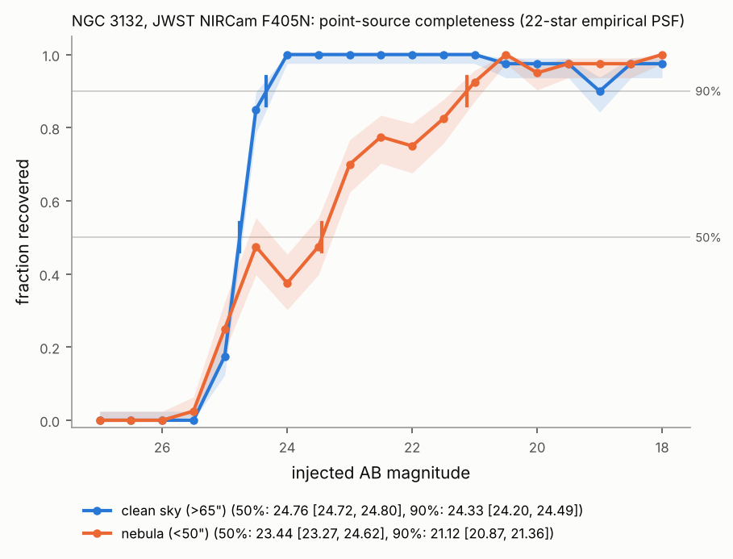

# Progress update, 7 Oct 2026: tasks 13–15

All results below are L1 measurements on authentic public JWST data, unless labelled otherwise.

## Task 13: detection completeness by injection–recovery

`astroledger.imaging.injection_recovery` adds point sources to a copy of the image and runs the
science detector on it. It reports completeness per magnitude with 68% intervals, the 50% and
90% limits with ranges, and a table of every injected source. The PSF is built from the image's
own stars (`empirical_psf`).

| NGC 3132, NIRCam F405N | 50% complete | 90% complete |
|------------------------|--------------|--------------|
| Clean sky | AB 24.76 [24.72, 24.80] | AB 24.33 |
| Inside the nebula | AB 23.4 [23.3, 24.6] | AB 21.1 |

**What testing on real data changed:** the first empirical PSF carried a pedestal of nebular
light, so injected stars were too spread out and their recovered flux was too low (0.4 of the
injected flux). Each star's local background is now subtracted first, and a regression test
guards this. Recovered fluxes now match how the detector measures real stars.

**Interpretation (L2):** inside the nebula, small-scale Brackett-α structure raises the detection
threshold. Even fairly bright stars (AB 22) can be lost there.

## Task 14: astrometry against Gaia DR3

Gaia DR3 is read selectively from MAST's Parquet copy on AWS (13.5 MB for this field). Positions
are moved along each star's proper motion to the observation date, then matched to the image's
stars. The report gives the offset, its error, the scatter and a rotation/scale fit.

| Image | Offset from Gaia (RA, Dec), mas | Scatter, mas |
|-------|-------------------------------|--------------|
| NIRCam F405N mosaic | +20.4 ± 1.3, +19.6 ± 1.3 | 4.6 |
| NIRCam F470N mosaic | +15.1 ± 3.6, −2.6 ± 3.6 | 11 |
| NIRCam F356W mosaic | +9.4 ± 0.9, +7.8 ± 2.7 | 2.4–6.8 |
| MIRI F770W single exposure | −35 ± 5, −35 ± 6 | 15 |

- **The offsets are real properties of the archive products.** The JWST pipeline's own catalogues
  give the same offsets.
- **Epoch propagation matters.** Without it, the scatter grows from about 3 to 14–18 mas.
- **L3 hypothesis:** the offsets reflect each mosaic's Stage-3 alignment. They could be tested by
  re-running that alignment against Gaia.

Details: [`docs/results/ngc3132_astrometry/`](../results/ngc3132_astrometry/README.md).

## Task 15: the mode router

Image analyses now refuse anything that is not a direct image, using the header's observing mode
(`EXP_TYPE` for JWST, `OBSTYPE` for HST).

This matters because JWST coronagraphic products are ordinary-looking 2-D `_i2d` images on disk.
Their star sits behind a mask, so measuring them as images gives nonsense.

The router was checked against authentic headers:
- refused, with the reason shown: coronagraphy, aperture-masking interferometry, IFU
  spectroscopy and four time-series spectroscopy products;
- accepted: NIRISS imaging.

## Data budget

99.11 MB of the 100 MB allowance used in total. Today's work used:
- 0.33 MB for one pipeline catalogue;
- 0.26 MB for nine headers;
- 0.05 MB for listings.

Everything else reused data already downloaded.
